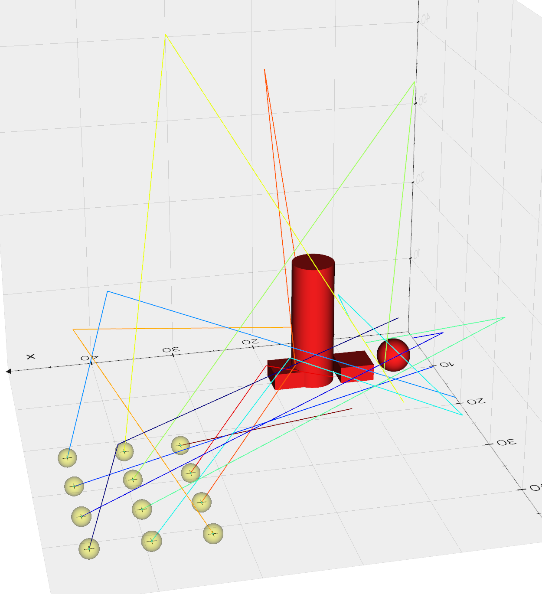
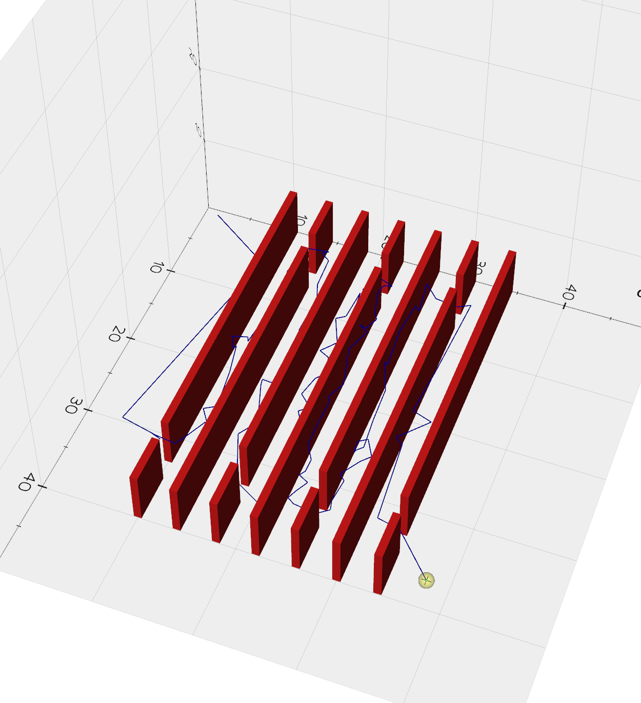
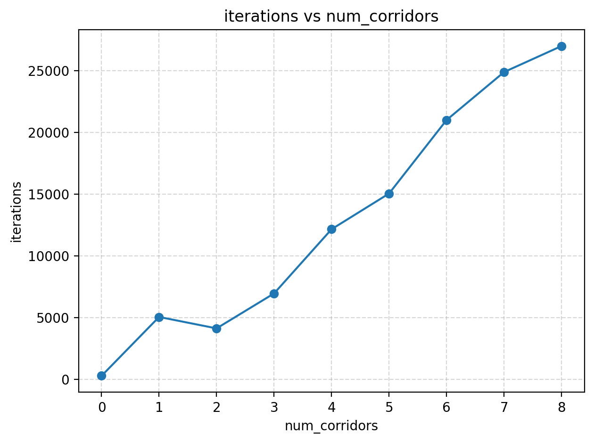
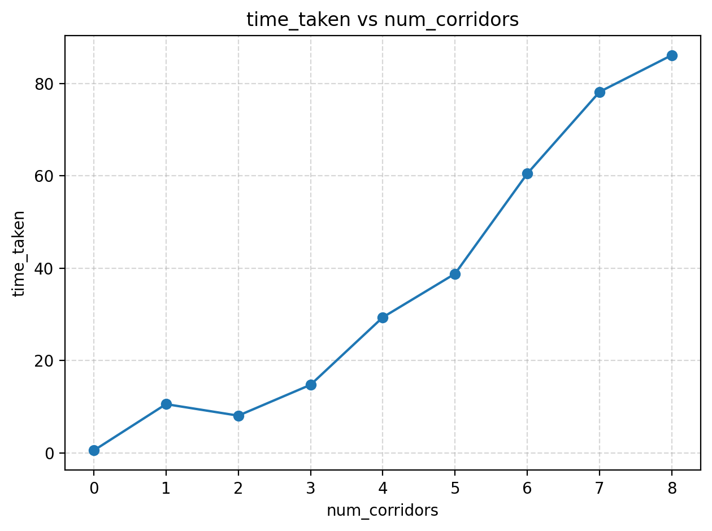
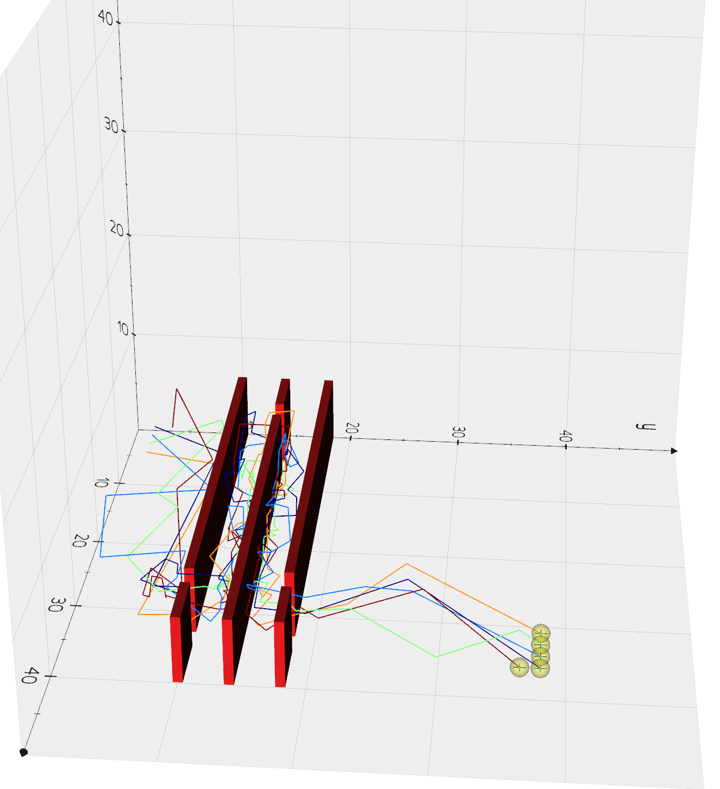
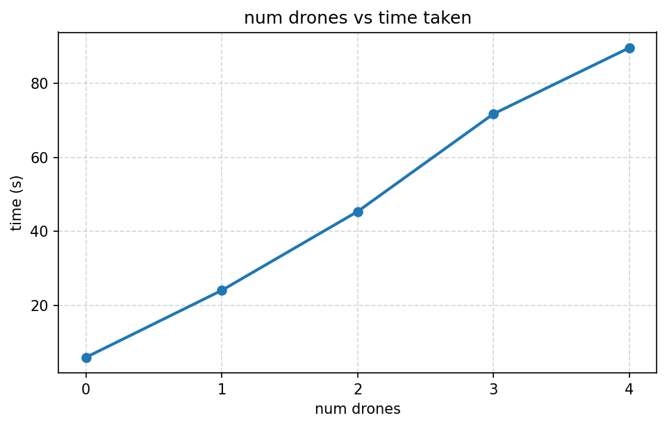

All commands are run from the root of the directory.

## Conda Environment

Please run

```
conda env create -f conda_env.yml
```

to activate conda, please run

```
conda activate comp4620-a1-yasaradeel
```
### To do a simple run, please run 

```
python multi_demo.py --env path_to_your_yaml
```

#### Examples

```
python multi_demo.py --env multi_drone_obs/env2.yaml

```

Use the arguments as provided in the argspace or use default ones.

### Code

All of it exists in the MultiPlanner directory. I have tried to give it a modular package structure.


### Environments are in
  * complexity_test_envs
  * drone_complexity_envs
  * multi_drone_obs
  * single_drone_obs

### Space Complexity Test

```
python space_complexity_test.py
```
A single drone goes over different corridors.







### Drone Complexity Test

```
python drone_count_complexity_test.py
```

Multiple Drones try to navigate through 2 corridors.






